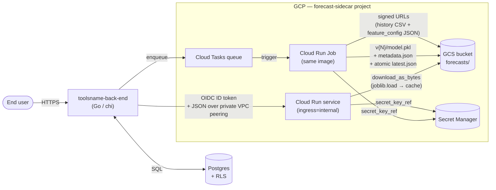
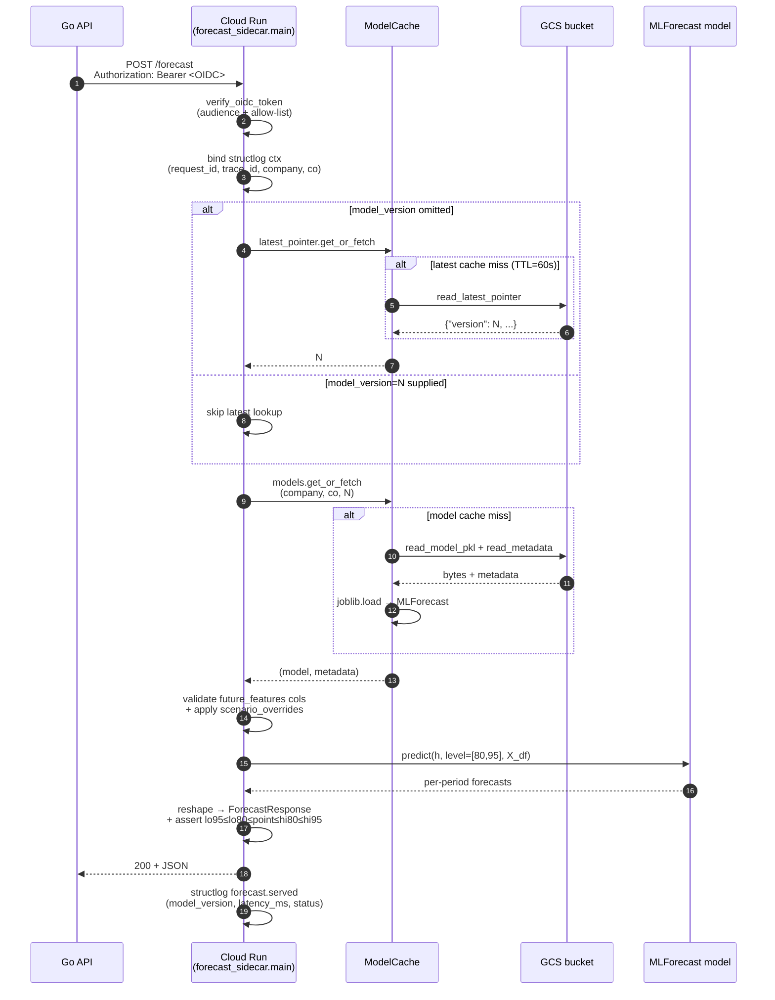
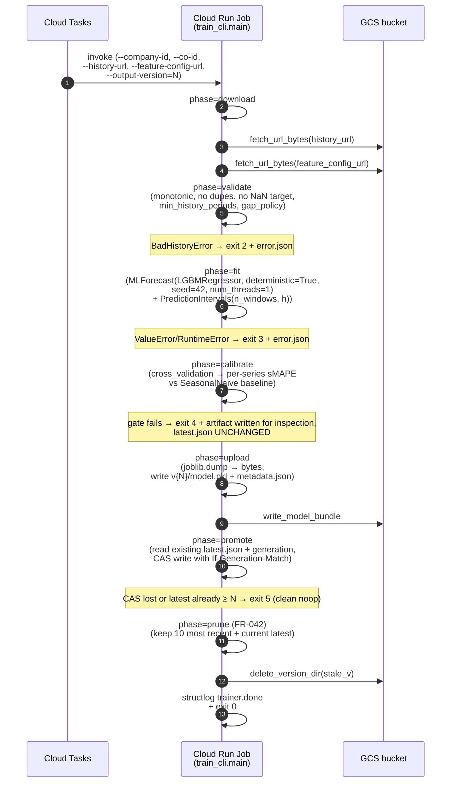
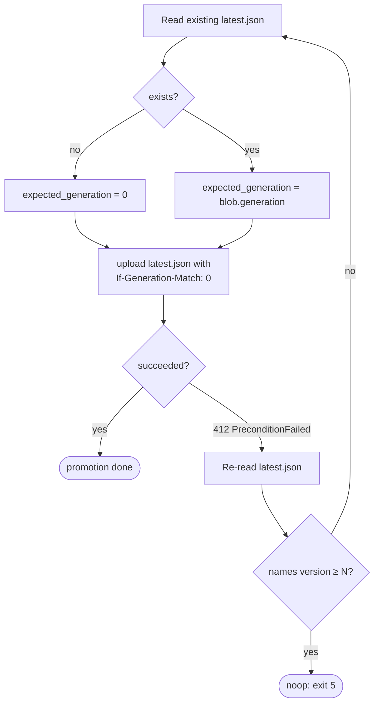
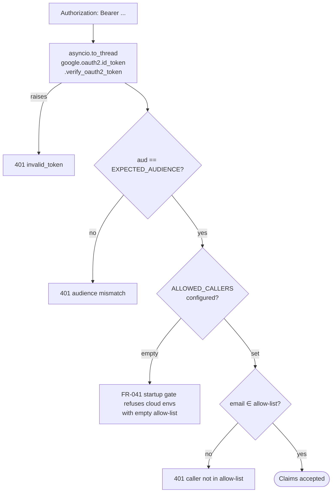

# Architecture: forecast-sidecar

This document is the mental-model entry point for the service. It mirrors
the eight sections from [research R11](../specs/001-forecast-sidecar-mvp/research.md):
system context → inference lifecycle → training lifecycle → storage layout
& atomic-promotion contract → cache semantics → auth & identity →
constitution → code map → out-of-scope.

For the formal contracts, see
[`specs/001-forecast-sidecar-mvp/contracts/`](../specs/001-forecast-sidecar-mvp/contracts/).
For the full task-level breakdown, see
[`specs/001-forecast-sidecar-mvp/tasks.md`](../specs/001-forecast-sidecar-mvp/tasks.md).

---

## 1. System context

The forecast-sidecar lives in its own GCP project and is reachable only
from the calling backend's VPC via a peered private path. The Go API is
the broker — this service holds no business logic and never touches the
backend's database.



**Network**: Direct VPC egress on Cloud Run + VPC peering with the backend
project + Cloud NAT for non-Google outbound + Private Google Access for
GCS / Secret Manager / OIDC JWKS. See [research R13](../specs/001-forecast-sidecar-mvp/research.md).

---

## 2. Inference request lifecycle



**Failure mapping** (FR-006 six-class taxonomy):

| Cause | HTTP | `error` |
|---|---|---|
| Missing/invalid token, audience mismatch, not in allow-list | 401 | `invalid_token` |
| Schema validation fail / horizon mismatch / missing future_exog cols / unknown override feature | 400 | `bad_request` |
| No `latest.json` for `(company, CO)` | 404 | `not_yet_trained` |
| Explicit `model_version=N` missing | 404 | `model_not_found` |
| `error.json` present + no `model.pkl` | 409 | `model_not_ready` |
| GCS unreachable (transient) | 503 | `storage_unavailable` |

---

## 3. Training job lifecycle



**Exit-code taxonomy**: `0` success / `1` unhandled / `2` bad input
(error.json + latest unchanged) / `3` training failure / `4` calibration
regression (artifact written, latest unchanged) / `5` promotion CAS lost
(clean noop). Full table in
[`contracts/train_cli.md`](../specs/001-forecast-sidecar-mvp/contracts/train_cli.md).

---

## 4. Storage layout & atomic-promotion contract

```text
gs://{FORECAST_BUCKET}/forecasts/
└── {company_id}/
    └── {computed_object_id}/
        ├── latest.json                # atomic pointer; never torn
        ├── v1/{model.pkl, metadata.json}
        ├── v2/{model.pkl, metadata.json}
        └── v3/{model.pkl, metadata.json[, error.json on failure]}
```

**Atomic promotion** uses GCS `If-Generation-Match` as a compare-and-swap:



GCS object versioning is **on at the bucket level** as defense-in-depth so
even a buggy overwrite is recoverable. The trainer's prune step preserves
the 10 most-recent versions per `(company, CO)` and always preserves the
one named by `latest.json`, even if it falls outside that window (FR-042).

---

## 5. Cache semantics

Two-tier in-process cache, lives on `app.state.cache`:

| Cache | Key | Value | Size | TTL |
|---|---|---|---|---|
| `models` | `(company, co, version)` | deserialized `MLForecast` | `MODEL_CACHE_SIZE` (default 100) | `MODEL_CACHE_TTL_SECONDS` (default 3600) |
| `latest_pointer` | `(company, co)` | resolved version `N` (`int`) | same | `LATEST_POINTER_TTL_SECONDS` (default 60) |

Both wrap `cachetools.TTLCache(timer=time.time)` so freezegun-style tests
can advance the clock. Per-key `asyncio.Lock` ("singleflight") wraps the
GCS fetch on a miss so concurrent first-loads collapse into a single
download.

The 60-second TTL on the latest-pointer cache is what makes promotions
take effect within ~1 minute (SC-009). Under the warmer 1-hour model
cache, a request still resolves fast (no GCS hit, no joblib.load) — only
the latest-pointer mapping has to be re-resolved.

---

## 6. Auth & identity model

**At the edge** (Cloud Run): `ingress=internal`. Public DNS resolution to
`*.run.app` from outside Google's network never reaches the application —
TLS doesn't terminate (FR-038, SC-018). **Inside the peered VPC**, every
request still requires a valid OIDC ID token (FR-040 defense in depth).

**Verification flow** (`forecast_sidecar.auth.verify_oidc_token`):



**Local-dev bypass** (`AUTH_BYPASS=1`) is honored only when
`EXPECTED_AUDIENCE` is `localhost` *and* `LOG_LEVEL=debug`. Settings'
post-init validator refuses to construct in any other combination — the
bypass is structurally impossible in cloud envs.

**Identity privileges** (FR-026, T079 IAM module):
- inference SA: `roles/storage.objectViewer` on the bucket
- trainer SA: `roles/storage.objectAdmin` on the bucket; `roles/run.invoker` on the Job
- Secret Manager access at the *secret* level, not project level

---

## 7. Constitution → code map

Each binding principle from
[`.specify/memory/constitution.md`](../.specify/memory/constitution.md)
v1.0.0 maps to a specific module / config that enforces it. When a
reviewer asks "is this PR consistent with the constitution?", this is
the first table to consult.

| Principle | Where it lives in the code |
|---|---|
| **I. Reproducibility** (NON-NEGOTIABLE) | [`seeds.py`](../src/forecast_sidecar/seeds.py) (random + numpy seeding), [`manifest.py`](../src/forecast_sidecar/manifest.py) (`build_manifest` with sha256 over canonicalized JSON, library_versions, git_sha), `LGBMRegressor(deterministic=True, seed=…, num_threads=1)` enforced in [`model/train.py`](../src/forecast_sidecar/model/train.py)::`_resolve_lightgbm_params` |
| **II. Temporal Integrity** (NON-NEGOTIABLE) | All lag/rolling/date features routed through mlforecast primitives in [`model/features.py`](../src/forecast_sidecar/model/features.py); evaluation via `MLForecast.cross_validation` in [`model/train.py`](../src/forecast_sidecar/model/train.py); inference accepts only declared `future_exog` from the caller — no `.shift()` anywhere in `src/` |
| **III. Data Contract** | [`schemas.py`](../src/forecast_sidecar/schemas.py) (Pydantic v2 strict, `extra="forbid"` on requests/responses), [`contracts/feature_config.schema.json`](../specs/001-forecast-sidecar-mvp/contracts/feature_config.schema.json) validated in `tests/contract/test_feature_config.py`, [`model/train.py`](../src/forecast_sidecar/model/train.py)::`validate_history` (gap policy, monotonicity, dupes, NaN target, min periods) |
| **IV. Baseline-Beating Evaluation** | [`model/baselines.py`](../src/forecast_sidecar/model/baselines.py) (`SeasonalNaive` + `enforce_baseline_gate`); the trainer's exit-code 4 path in [`train_cli.py`](../src/forecast_sidecar/train_cli.py) writes `error.json` and refuses promotion when the gate fails |
| **V. Configuration Over Code** | Per-`(company, CO)` `feature_config.json` is the unit of variation; [`configs/lightgbm_defaults.yaml`](../configs/lightgbm_defaults.yaml) is layered under per-config overrides; service settings via `pydantic_settings.BaseSettings`; envs differ only in `terraform.tfvars` + Secret Manager — no `if env == "prod"` branches in `src/` |

If you need a deeper trace for any one principle, open the linked module —
each function carries a docstring referencing the principle it serves.

---

## 8. Out of scope and future evolution

The spec's [§15 Out of Scope](../specs/001-forecast-sidecar-mvp/spec.md)
lists items explicitly excluded from v1. For each, here is the surgical
diff that would land it later:

| Future capability | Where it would attach |
|---|---|
| **Hierarchical reconciliation** | Add `hierarchicalforecast` to deps, a new `model/hierarchy.py`, and a `hierarchy` block in `feature_config.json`. Inference response would gain a per-level breakdown. |
| **Cold-start zero-shot** | Trainer detects insufficient history and emits a "fallback" model artifact (TimesFM); inference branches in [`model/predict.py`](../src/forecast_sidecar/model/predict.py)::`load_or_fetch` based on metadata. |
| **Online learning** | A `partial_fit` entrypoint in `train_cli.py` that bumps `output-version` without a full refit; trade-off: drift detection becomes the operator's job. |
| **SHAP / forecast explanation** | New `POST /forecast/explain` route returning per-feature contributions; SHAP computed in `model/predict.py` and dropped onto the response. |
| **Cross-company global model** | Requires DPA/legal sign-off (per spec). When approved, training reads a join across `(company, CO)` and writes a single `global/v{N}/` artifact; inference resolves `latest.json` differently. |
| **GPU / neural models** | New `models` array in `feature_config.json` listing NHITS/TFT alongside LightGBM; trainer dispatches on model name. Cloud Run Job needs GPU class. |

None of these change the public HTTP contract in
[`contracts/openapi.yaml`](../specs/001-forecast-sidecar-mvp/contracts/openapi.yaml).
The wire format and error taxonomy are stable across these evolutions.

---

## Pointers

- [README.md](../README.md) — landing page
- [Constitution](../.specify/memory/constitution.md)
- [Spec](../specs/001-forecast-sidecar-mvp/spec.md)
- [Plan](../specs/001-forecast-sidecar-mvp/plan.md)
- [Research](../specs/001-forecast-sidecar-mvp/research.md)
- [Data model](../specs/001-forecast-sidecar-mvp/data-model.md)
- [Contracts](../specs/001-forecast-sidecar-mvp/contracts/)
- [Quickstart](../specs/001-forecast-sidecar-mvp/quickstart.md)
- [Tasks](../specs/001-forecast-sidecar-mvp/tasks.md)
